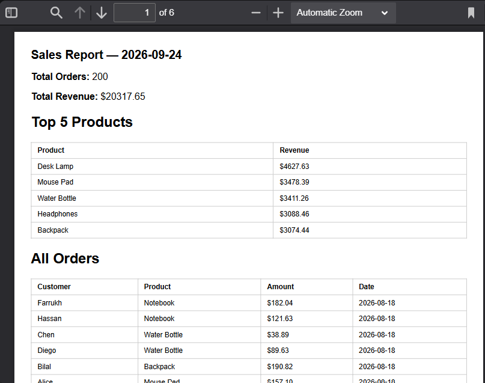

# PDF Report Generator

FlyRank Internship — Backend Track — Week 4 — Assignment A8

## What this is
A small pipeline that queries a SQLite database, aggregates the results into a report,
renders it as a PDF using Playwright, and serves it by link through an Express API.

## Dataset
Shop dataset — 200 seeded orders (customer, product, amount, created_at).

## How to run

\`\`\`bash
npm install
npx playwright install chromium
node --experimental-sqlite seed.js
node --experimental-sqlite index.js
\`\`\`

Server runs on http://localhost:3000

## Endpoints
- `GET /health` — health check
- `POST /reports` — generates a report (or returns today's existing one), returns `{ id, file }`
- `GET /reports/:id` — returns the report record
- `GET /reports/:id/file` — downloads the PDF

## Aggregation SQL

\`\`\`sql
SELECT COUNT(*) FROM orders;
SELECT SUM(amount) FROM orders;
SELECT product, SUM(amount) as revenue FROM orders GROUP BY product ORDER BY revenue DESC LIMIT 5;
SELECT created_at, COUNT(*) FROM orders WHERE created_at >= date('now', '-7 days') GROUP BY created_at;
\`\`\`

## Proof: generate and download

\`\`\`bash
curl -i -X POST http://localhost:3000/reports
curl -o my-report.pdf http://localhost:3000/reports/1/file
\`\`\`

## Stage 4 note
Generation runs synchronously inside the request, taking a few seconds. This would move
to a background job (as in A7) once report generation got slower or concurrent requests
became common — the client shouldn't be held hostage by a multi-second wait.

## Stage 5 note
`POST /reports` checks for an existing report from today before generating a new one, so
duplicate requests (e.g. a double-clicked button) return the same report instead of
creating a second file. A real-world example: a "send invoice" button that fires twice
shouldn't invoice the customer twice.

## Screenshot
